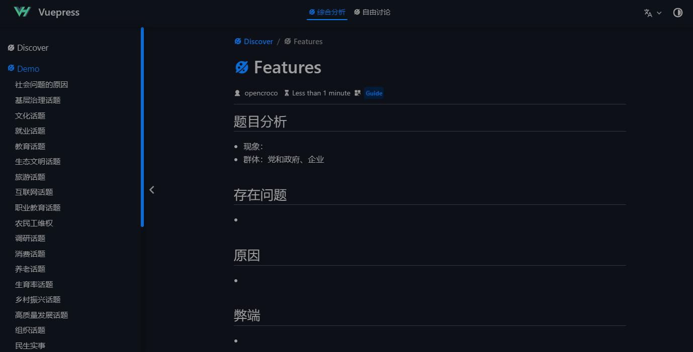
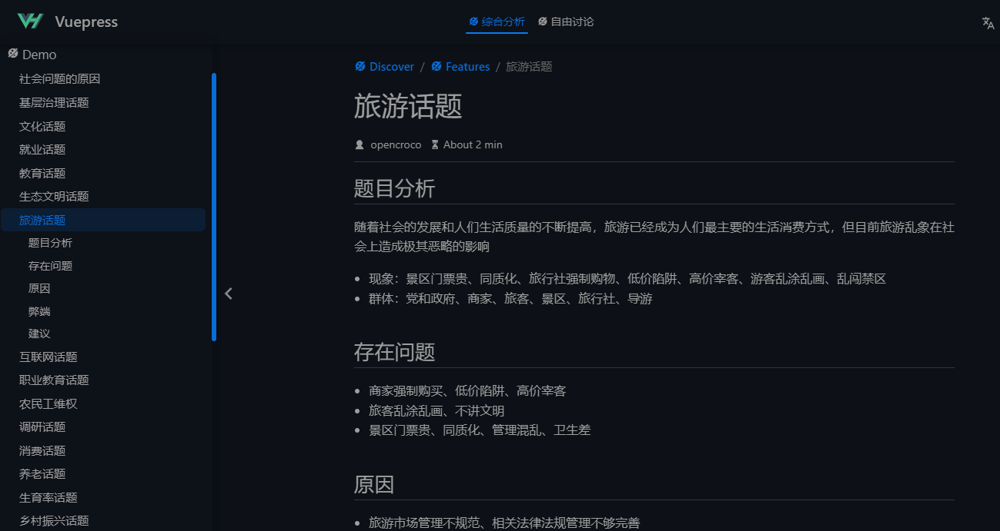

#  

[![MIT licensed][11]][12] 

[1]: https://img.shields.io/docker/pulls/xtaci/kcptun
[2]: https://hub.docker.com/r/xtaci/kcptun
[3]: https://travis-ci.org/xtaci/kcptun.svg?branch=master
[4]: https://travis-ci.org/xtaci/kcptun
[5]: https://goreportcard.com/badge/github.com/xtaci/kcptun
[6]: https://goreportcard.com/report/github.com/xtaci/kcptun
[11]: https://img.shields.io/github/license/xtaci/kcptun
[12]: LICENSE.txt
[13]: https://img.shields.io/github/v/release/xtaci/kcptun?color=orange
[14]: https://github.com/xtaci/kcptun/releases/latest
[15]: https://img.shields.io/github/downloads/xtaci/kcptun/total.svg?maxAge=1800&color=orange
[16]: https://github.com/xtaci/kcptun/releases
[17]: https://opencroco.github.io/logo.svg
[18]: https://github.com/vuejs/vuepress



### Requirements

| Target | Minimum | Recommended |
| --- | --- | --- |
| System | aix darwin dragonfly freebsd linux netbsd openbsd solaris windows | linux |
| Memory | >8192MB | >1024MB |
| CPU | ANY | amd64 with AES-NI & AVX2 |
| Node Version| > 18.x | > 18.x | 


### QuickStart

Increase the number of open files on your server, as:

```
$ npm install
$ npm run docs:dev
```

### Build from source

```
$ git clone https://github.com/opencroco/opengongkao.git
$ cd opengongkao
$ npm install
$ npm run docs:build
```


### Overview

<p align="left"></p>


### References

1. https://github.com/vuejs/vuepress -- Vuepress - Minimalistic Vue-powered static site generator.
